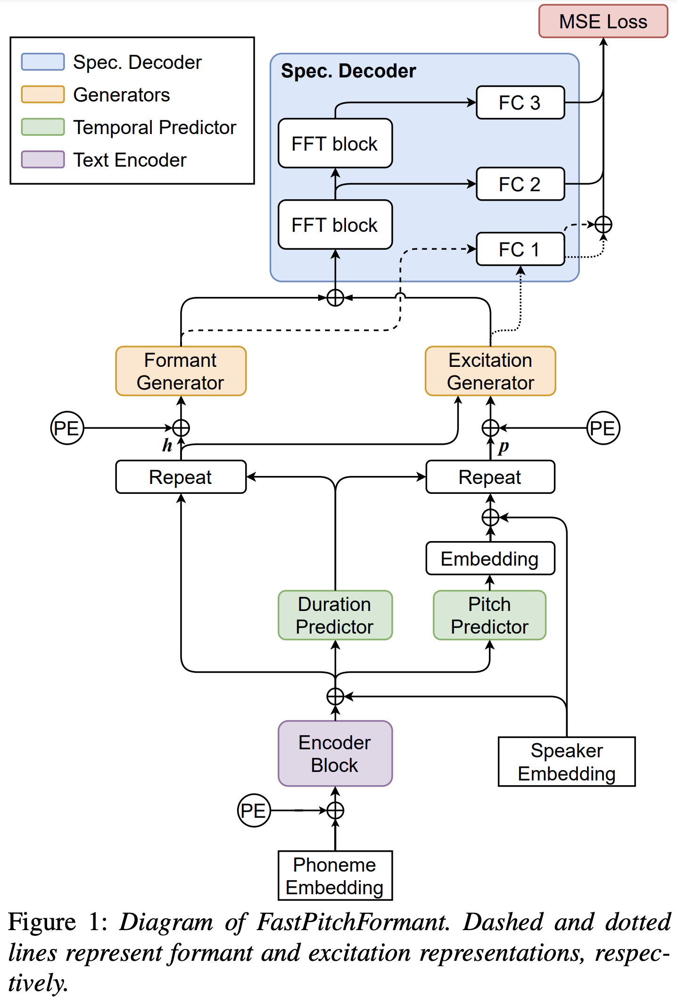
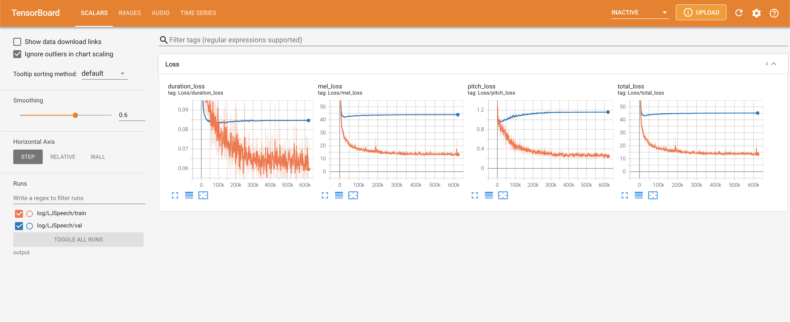
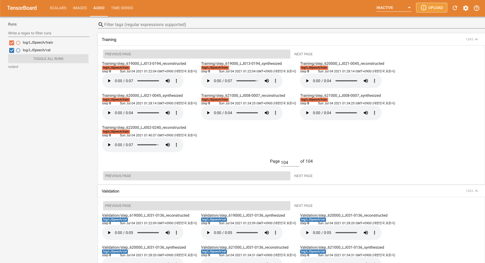

# FastPitchFormant - PyTorch Implementation

PyTorch Implementation of [FastPitchFormant: Source-filter based Decomposed Modeling
for Speech Synthesis](https://arxiv.org/abs/2106.15123). 

<p align="center">
    
</p>

# Quickstart

## Dependencies
You can install the Python dependencies with
```
pip3 install -r requirements.txt
```

## Inference

You have to download the [pretrained models](https://drive.google.com/drive/folders/1Pa7wNfmtt0VfWxFNA3xdChqLsYFTvYuA?usp=sharing) and put them in ``output/ckpt/LJSpeech/``.

For English single-speaker TTS, run
```
python3 synthesize.py --text "YOUR_DESIRED_TEXT" --restore_step 600000 --mode single -p config/LJSpeech/preprocess.yaml -m config/LJSpeech/model.yaml -t config/LJSpeech/train.yaml
```
The generated utterances will be put in ``output/result/``.


## Batch Inference
Batch inference is also supported, try

```
python3 synthesize.py --source preprocessed_data/LJSpeech/val.txt --restore_step 600000 --mode batch -p config/LJSpeech/preprocess.yaml -m config/LJSpeech/model.yaml -t config/LJSpeech/train.yaml
```
to synthesize all utterances in ``preprocessed_data/LJSpeech/val.txt``

## Controllability
The pitch/speaking rate of the synthesized utterances can be controlled by specifying the desired pitch/energy/duration ratios.
For example, one can increase the speaking rate by 20 % and decrease the pitch by 20 % by

```
python3 synthesize.py --text "YOUR_DESIRED_TEXT" --restore_step 600000 --mode single -p config/LJSpeech/preprocess.yaml -m config/LJSpeech/model.yaml -t config/LJSpeech/train.yaml --duration_control 0.8 --pitch_control 0.8
```

# Training

## Datasets

The supported datasets are

- [LJSpeech](https://keithito.com/LJ-Speech-Dataset/): a single-speaker English dataset consists of 13100 short audio clips of a female speaker reading passages from 7 non-fiction books, approximately 24 hours in total.

## Preprocessing
 
First, run 
```
python3 prepare_align.py config/LJSpeech/preprocess.yaml
```
for some preparations.

As described in the paper, [Montreal Forced Aligner](https://montreal-forced-aligner.readthedocs.io/en/latest/) (MFA) is used to obtain the alignments between the utterances and the phoneme sequences.
Alignments for the LJSpeech datasets are provided [here](https://drive.google.com/drive/folders/1DBRkALpPd6FL9gjHMmMEdHODmkgNIIK4?usp=sharing).
You have to unzip the files in ``preprocessed_data/LJSpeech/TextGrid/``.

After that, run the preprocessing script by
```
python3 preprocess.py config/LJSpeech/preprocess.yaml
```

Alternately, you can align the corpus by yourself. 
Download the official MFA package and run
```
./montreal-forced-aligner/bin/mfa_align raw_data/LJSpeech/ lexicon/librispeech-lexicon.txt english preprocessed_data/LJSpeech
```
or
```
./montreal-forced-aligner/bin/mfa_train_and_align raw_data/LJSpeech/ lexicon/librispeech-lexicon.txt preprocessed_data/LJSpeech
```

to align the corpus and then run the preprocessing script.
```
python3 preprocess.py config/LJSpeech/preprocess.yaml
```

## Training

Train your model with
```
python3 train.py -p config/LJSpeech/preprocess.yaml -m config/LJSpeech/model.yaml -t config/LJSpeech/train.yaml
```

# TensorBoard

Use
```
tensorboard --logdir output/log/LJSpeech
```

to serve TensorBoard on your localhost.
The loss curves, synthesized mel-spectrograms, and audios are shown.





# Implementation Issues

- The current implementation and pre-trained model are using normalized pitch values. In my experiments, the pitch controllability is not dynamic with the proposed pitch shifts. You may set `normalization` to `False` in `./config/LJSpeech/preprocess.yaml` when you need to see more wide pitch range as the paper described.
- Please note that the paper trained the model up to 1000k whereas the current implementation provides 600k pre-trained model.
- Use **HiFi-GAN** instead of **VocGAN** for vocoding.

# Citation

```
@misc{lee2021fastpitchformant,
  author = {Lee, Keon},
  title = {FastPitchFormant},
  year = {2021},
  publisher = {GitHub},
  journal = {GitHub repository},
  howpublished = {\url{https://github.com/keonlee9420/FastPitchFormant}}
}
```

# References
- [FastPitchFormant: Source-filter based Decomposed Modeling
for Speech Synthesis](https://arxiv.org/abs/2106.15123)
- [ming024's FastSpeech2](https://github.com/ming024/FastSpeech2)
